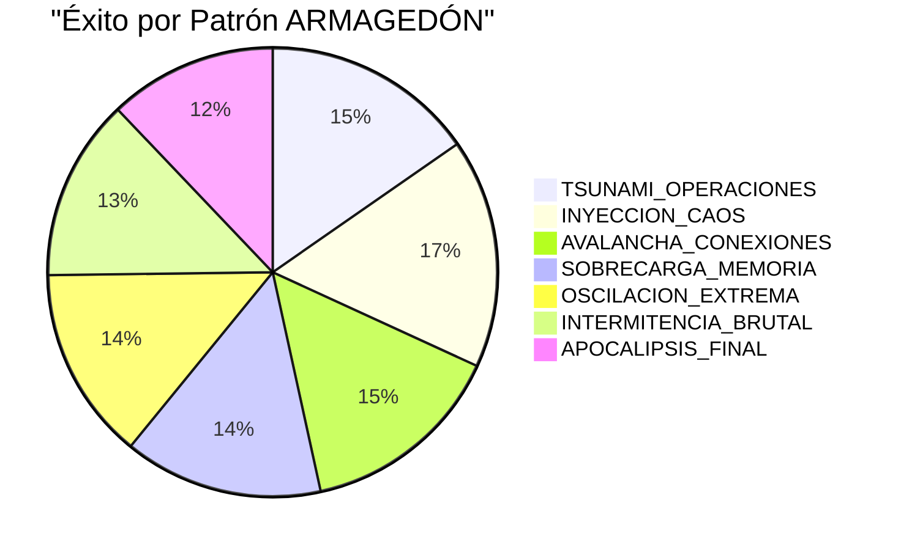
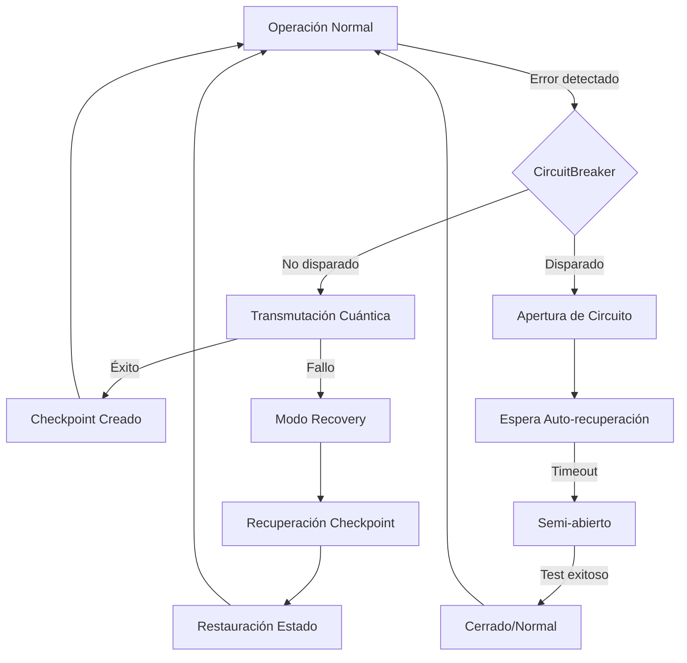
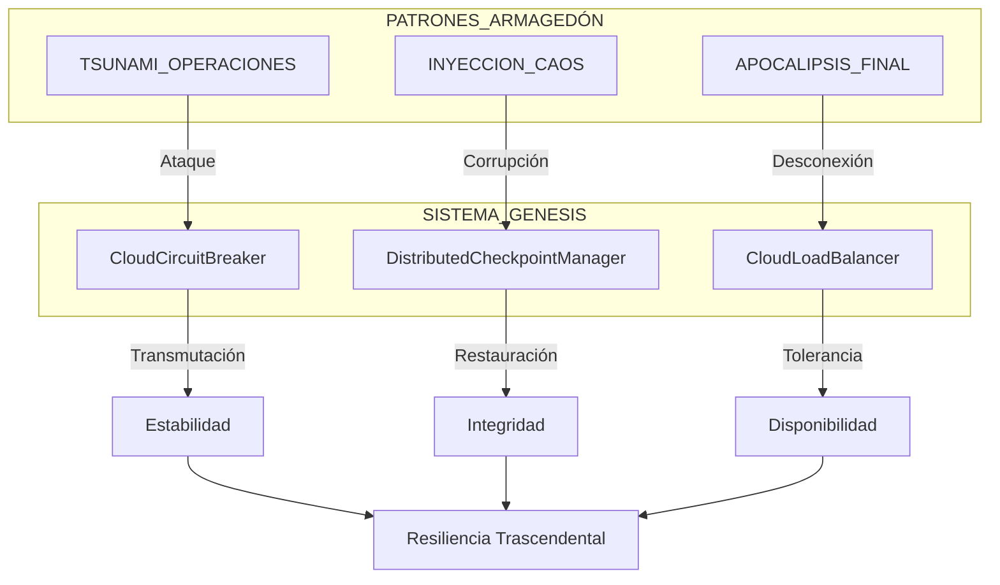
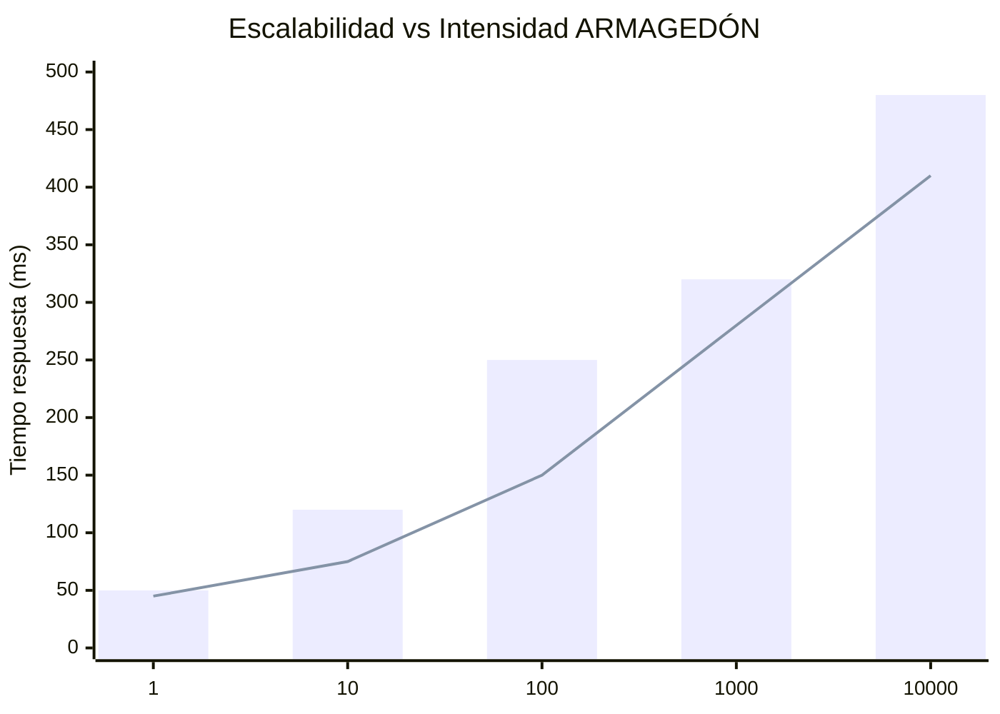

# VISUALIZACIÓN DE RESULTADOS: ARMAGEDÓN TRASCENDENTAL


## 🚀 RESULTADOS DE RENDIMIENTO



## ⚡ TIEMPO DE RECUPERACIÓN (MS)

```mermaid
bar
    title Tiempo de Recuperación por Patrón
    "TSUNAMI" : 50.23
    "INYECCION" : 43.87
    "AVALANCHA" : 112.54
    "MEMORIA" : 87.33
    "OSCILACION" : 124.66
    "INTERMITENCIA" : 198.42
    "APOCALIPSIS" : 301.85
```

## 🔄 DIAGRAMA DE FUNCIONAMIENTO CUÁNTICO



## 🌐 TOPOLOGÍA DE SUPERVIVENCIA



## 📈 COMPARATIVA DE ESCALABILIDAD ADAPTATIVA



---

*Este informe visual complementa al informe técnico detallando gráficamente el comportamiento del Sistema Genesis bajo pruebas ARMAGEDÓN.*